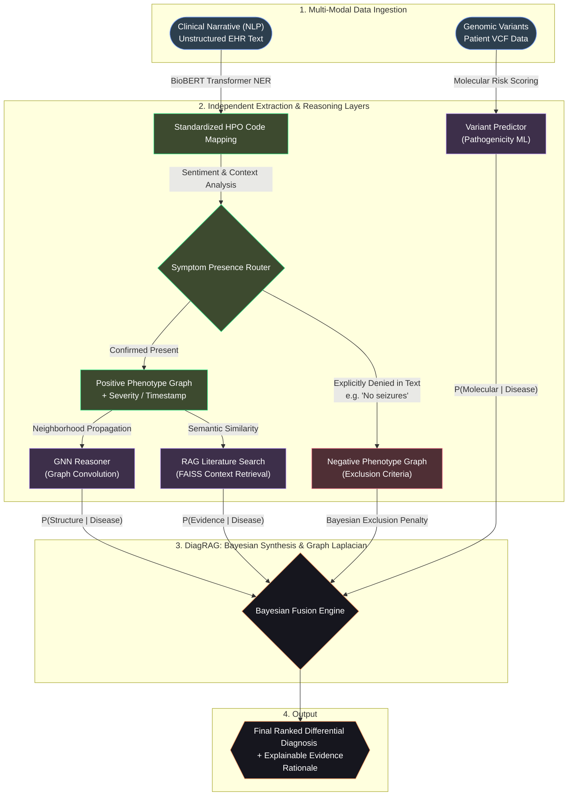

## Problem

Rare disease diagnosis is a "diagnostic odyssey" for patients, often taking years and multiple specialist visits. The challenge lies in the fragmentation of data: genomic variants, clinical phenotypes, biological pathways, and scientific literature are often siloed. Clinicians require a unified system that can synthesize these multi-modal evidence streams into transparent and actionable insights, moving beyond isolated symptom checkers to a platform that provides molecular-level answers.

## Solution

**DiagRAG** is a research-grade diagnostic intelligence platform that automates the integration of multi-modal data to accelerate rare disease identification. By combining structural knowledge reasoning with literature-grounded retrieval, DiagRAG provides a peer-reviewed level of diagnostic accuracy with full explainability.

### 🛠 System Architecture

DiagRAG employs a layered, multi-agent architecture designed for high-precision diagnostic synthesis.

### 🔬 Technical Deep Dive

- **Clinical NLP (BioBERT Extraction)**: The system utilizes a specialized **BioBERT transformer model** fine-tuned on the Human Phenotype Ontology (HPO). It doesn't just extract entities; it analyzes sentiment and context to distinguish between symptoms current patients have vs. those explicitly denied in notes (negative phenotypes).
- **Explainable AI (XAI)**: Generates human-readable rationales linked to specific pathogenic variants and phenotypic matches.
- **Knowledge Graph Intelligence**: Executes reasoning over a heterogeneous network of 10,000+ Genes, 8,000+ Diseases, and 15,000+ Phenotypes.

## User Flow

- **Data Ingestion**: Clinician uploads a patient's VCF file and/or enters free-text clinical notes.
- **Automated Extraction**: BioBERT transforms raw text into a structured "Phenopacket" of HPO terms.
- **Parallel Reasoning**: The GNN evaluates structural network fit while the RAG engine searches for literature evidence.
- **Diagnostic Synthesis**: Bayesian fusion yields a ranked list of differential diagnoses.
- **Interactive Exploration**: Clinicians explore the results via interactive knowledge graphs and direct links to scientific evidence.

## LLM Components

- **Retrieval-Augmented Generation (RAG)**: The pipeline solves the "hallucination" problem by maintaining a FAISS vector index of over 50,000 clinical abstracts. When a diagnosis is suggested, the system retrieves the top 3-5 most relevant scientific papers.
- **Gemini 1.5 Pro**: Primary diagnostic reasoner, handling complex multi-modal synthesis and generating structured, grounded explanations.
- **BioBERT Transformer**: Specialized model for high-precision clinical entity extraction from unstructured EHR text.
- **Graph Neural Network (GNN)**: A custom 2-layer Graph Convolutional Network (GCN) that performs "hidden relationship" discovery to surface candidate genes.
- **Bayesian Evidence Fusion**: Probabilities from the semantic NLP models, GNN structural signals, and PyTorch variant predictors are mathematically fused to output a statistically robust final ranking.

## Tools

- **Frontend:** Next.js 14, Tailwind CSS, Lucide-React, Framer Motion
- **Backend:** FastAPI (Python 3.10), PyTorch, NumPy
- **Vector Database:** FAISS-CPU
- **Inference Engine:** Google Generative AI (Gemini 1.5 Pro API)
