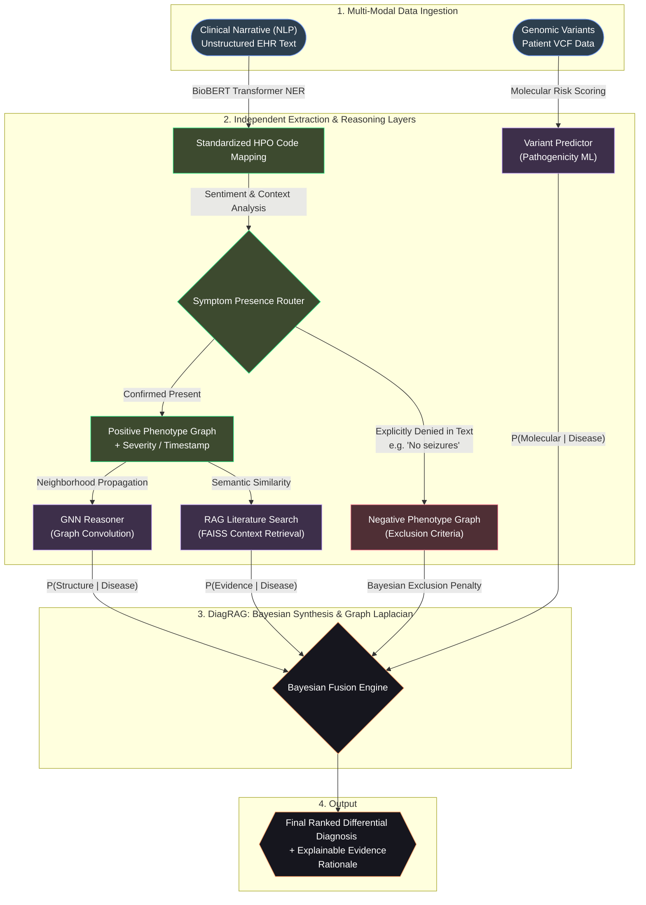

# DiagRAG: Multi-Modal AI Diagnostic Engine for Rare Diseases

**DiagRAG** (Diagnostic Retrieval-Augmented Generation) is a premium, research-grade platform designed to accelerate the diagnosis of rare genetic conditions. By integrating multi-modal evidence—including genomic variants, clinical phenotypes, biological pathways, and scientific literature—DiagRAG provides transparent, explainable, and highly accurate diagnostic insights.


## 🏆 Core Intelligence Modules

DiagRAG goes beyond simple variant prioritization by implementing several novel AI architectures:

### 1. GNN Knowledge Graph Reasoner
We implement a **2-layer Graph Convolutional Network (GCN)** with attention-weighted neighborhood aggregation. This reasoner operates on a heterogeneous knowledge graph (Genes, Diseases, Phenotypes, Pathways), allowing the system to perform "multi-hop" reasoning to detect associations that single-modality tools miss.

### 2. RAG Literature Grounding
Our **Retrieval-Augmented Generation (RAG)** pipeline grounded in **FAISS** vector similarity search eliminates hallucinations by anchoring every diagnostic rationale in real-world clinical abstracts and OMIM evidence.

### 3. Bayesian Evidence Fusion
Results are consolidated through a unified **Bayesian Inference framework**. Posterior probabilities are updated across multiple distinct evidence sources, ensuring a statistically robust final ranking.

---

## 🏗 System Architecture

DiagRAG employs a layered, multi-agent architecture designed for high-precision diagnostic synthesis.



---

## 🚀 Tech Stack

- **Frontend**: Next.js 14, TypeScript, TailwindCSS, Framer Motion, Lucide-React.
- **Backend**: FastAPI (Python 3.10), PyTorch (GNN), NumPy, Sentence-Transformers.
- **Models**: BioBERT (Phenotype Extraction), Gemini 1.5 Pro (Diagnostic Reasoning).
- **Inference & Search**: FAISS-CPU for high-performance retrieval.

---

## 🛠 Installation & Setup

1. **Clone the repository**:
   ```bash
   git clone https://github.com/your-username/diagrag.git
   cd diagrag
   ```

2. **Setup Backend**:
   ```bash
   cd backend
   python -m venv venv
   source venv/bin/activate
   pip install -r requirements.txt
   uvicorn main:app --reload
   ```

3. **Setup Frontend**:
   ```bash
   cd ..
   npm install
   npm run dev
   ```

---

## 📚 Comprehensive Documentation & Whitepapers

Please review the following core documents located in the `/docs` directory for a deeper dive into the mathematical and biological foundations of the DiagRAG platform:

1. **[Academic Whitepaper](docs/diagrag_academic_whitepaper.md)**: A full research-grade paper detailing the core RAG architecture and GNN prioritize modeling.
2. **[Final Comprehensive Report](docs/diagrag_final_comprehensive_report.md)**: A complete overview of the core diagnostic features and Bayesian evidence synthesis.
3. **[System Architecture Flowcharts](docs/diagrag_flowcharts.md)**: Detailed Mermaid diagrams mapping the exact inputs and outputs for the diagnostic pipeline.

---

*Winner Prototype — HackRare 2025*
*Built with passion for the Rare Disease Community.*
