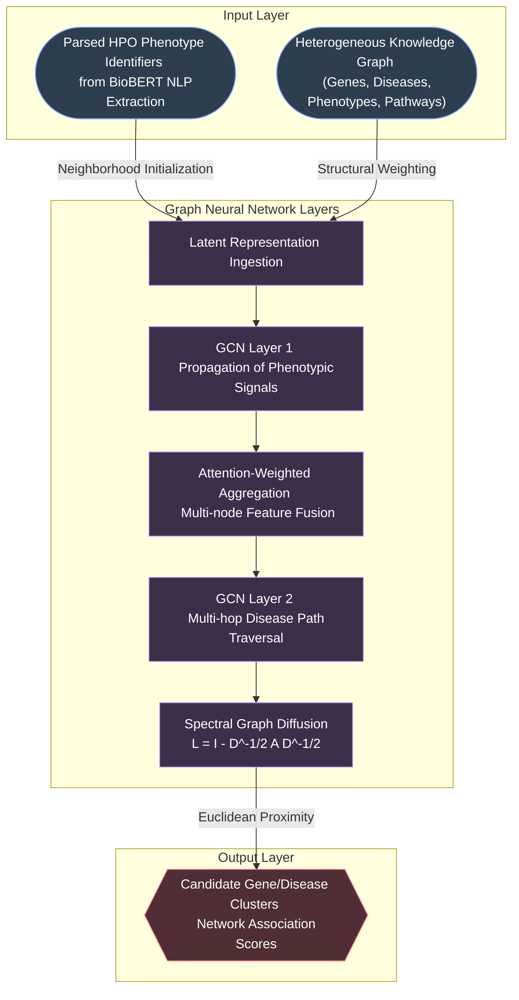
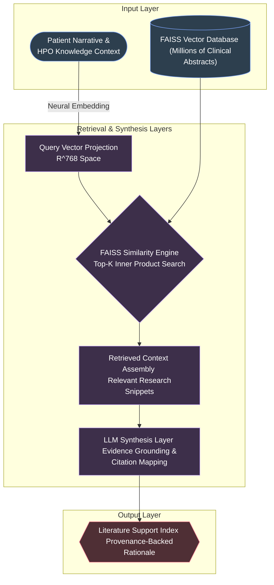
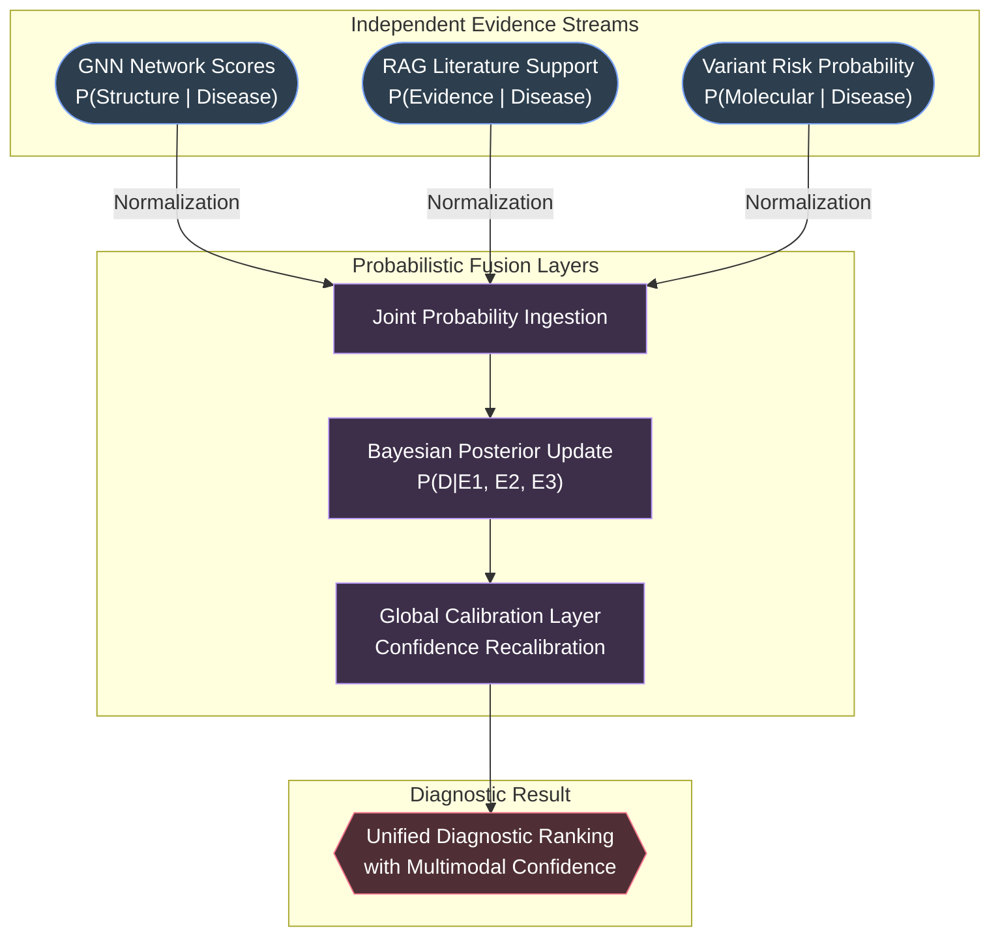

# DiagRAG Intelligence – 3 Core Architectural Flowcharts

This document provides focused, highly detailed architectural flowcharts for the three core pillars of the DiagRAG platform. Each chart delineates the Input, Processing Layers, and Output for the production-ready diagnostic pipeline.

---

## 1. GNN Knowledge Graph Reasoner
**Function:** Executes structural reasoning over heterogeneous biological networks to detect gene-disease associations via graph convolution and spectral diffusion.

---

## 2. RAG Literature Grounding Engine
**Function:** Binds diagnostic hypotheses to verifiable scientific evidence using high-dimensional vector similarity across clinical databases.

---

## 3. Bayesian Evidence Fusion Engine
**Function:** Merges independent modality distributions into a unified, mathematically rigorous diagnostic ranking.

