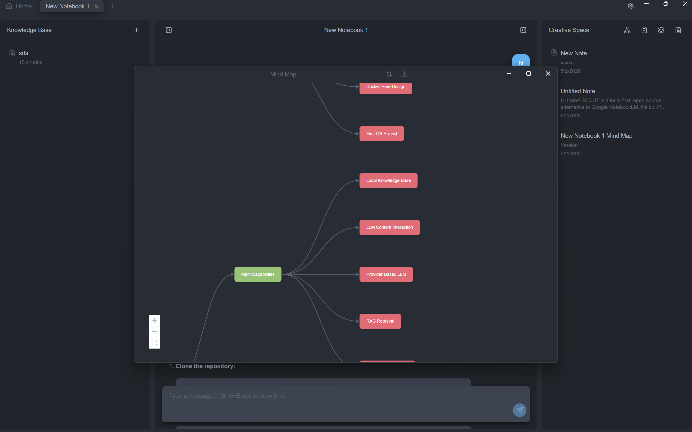

# SCOUT

SCOUT is a local-first desktop app for turning your files into a searchable knowledge base with AI chat.

It is an open-source, privacy-focused alternative to NotebookLM that runs without Docker.



## What It Does

- Import documents and web content
- Build local RAG context from your data
- Ask questions and get source-grounded answers
- Use multiple model providers (OpenAI, DeepSeek, Ollama, and more)

## Why SCOUT

- Local-first storage (SQLite)
- No server setup required
- Works as a desktop app (Electron)
- Easy for learners and developers

## Quick Start

### Run Locally

```bash
git clone https://github.com/yaksh1/SCOUT.git
cd SCOUT
pnpm install
pnpm dev
```

### Build

```bash
pnpm build
```

## Tech Stack

- Electron
- React + TypeScript
- Vite
- Tailwind CSS
- SQLite + sqlite-vec

## Contributing

Issues and pull requests are welcome.
